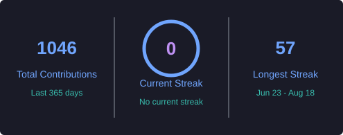

<h1 align="center">Hi 👋, I'm Aditya Kumar</h1>
<h3 align="center">Software Engineer | C++ Developer | Systems Programming Enthusiast</h3>

  

  
  
  
  

---

## 👨‍💻 About Me

- 🎓 B.Tech in Computer Science and Engineering from **The National Institute of Engineering, Mysore**
- 💼 Ex Software Developer Intern at **Nokia**
- 💻 Passionate about **Software Engineering, Systems Programming, and Backend Development**
- 🌱 Currently exploring **Distributed Systems, System Design, and High-Performance C++**
- 🐧 Linux enthusiast and daily **Arch Linux** user
- 🎯 Looking for **Software Engineer / Backend Engineer / C++ Developer** roles.

---

## 🛠️ Tech Stack

### 💻 Languages

### 🌐 Frameworks & Web

### 🗄️ Databases

### 🐧 Systems Programming

### 🤖 Machine Learning & Computer Vision

### ⚙️ DevOps, Automation & Tools

### 🧠 Core Computer Science

---

## 🚀 Featured Projects

### 🔹 [ThreadLink](https://github.com/kumar17aaditya/ThreadLink)
**Tech:** C++, Linux, TCP/IP Sockets, Multithreading

Multi-threaded TCP chat system built in C++ using Linux sockets and thread-per-client architecture.

---

### 🔹 [RetinaSense-AI](https://github.com/kumar17aaditya/RetinaSense-AI)
**Tech:** Python, TensorFlow, Flask, ResNet50

Deep learning-based diabetic retinopathy detection web application using TensorFlow and ResNet50.

---

### 🔹 [InfraPulse](https://github.com/kumar17aaditya/InfraPulse)
**Tech:** Python, HTML, JavaScript, Docker

Linux server health monitoring and automation analytics platform with real-time metrics collection, REST APIs, SQL analytics, anomaly detection, and Dockerized deployment.

---

## 🏆 Competitive Programming

  

  <b>LeetCode Contest Rating:</b> 1630+

---

## 📊 GitHub Statistics

  
  

  

  <picture>
    <source
      media="(prefers-color-scheme: dark)"
      srcset="https://raw.githubusercontent.com/kumar17aaditya/kumar17aaditya/output/github-contribution-grid-snake-dark.svg"
    />
    <source
      media="(prefers-color-scheme: light)"
      srcset="https://raw.githubusercontent.com/kumar17aaditya/kumar17aaditya/output/github-contribution-grid-snake.svg"
    />
    
  </picture>

---

## 📫 Connect With Me

- 📧 Email: **kumar17aaditya@gmail.com**
- 💼 LinkedIn: **https://linkedin.com/in/aditya-kumar-82a292251**

---

  

  Happy Coding! 🚀

  Thanks for visiting my profile!

